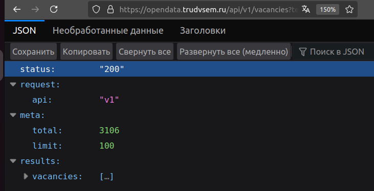

# Глава 2. Давайте загрузим в базу данных что-нибудь!

Итак, мы установили Postgres и всё настроили для начала работы (однако это не означает, что мы настроили СУБД для работы в продакшене). Всё, что у нас есть на этом этапе - это пустая база данных, ассоциированная с нашим пользователем. Не очень весело иметь доступ к пустой базе данных или создавать и наполнять её вручную, верно? Естественным желанием новичков является загрузка в СУБД какого-то датасета, который можно "пощупать", на котором можно потренироваться, поэкспериментировать. Многие учебники предлагают скачать ту или иную базу данных с сайта издательства, но, на мой взгляд, у этого решения есть ряд последствий:

1. Эти данные как правило находятся в рафинированном виде, и их загрузка не требует какой-либо обработки и решения проблем - в реальной жизни такого практически не бывает.
2. После загрузки в СУБД базы данных она (загруженная БД) начинает вас контролировать и ограничивать, а вы этого не видите.
3. Начинать знакомство с баз данных прямо с загрузки готового продукта крайне нелогично, поскольку вы не видите полного пайплайна его разработки, начиная от проектирования и учёта наложенных на базу данных ограничений предметной области и заканчивая возникшими из-за этого особенностями её архитектуры. В общем, как преподаватель и сторонник системного подхода к обучению я крайне не рекомендую начинать изучение курса с загрузки сторонних баз данных в чистом виде.

Тем не менее, сразу после установки СУБД на компьютере мы сделаем это - попытаемся загрузить данные из сторонних источников, находящиеся в открытом доступе, чтобы увидеть, что у нас из этого получится и что может помешать нам в достижении наших целей. Попробуем - и сразу же перейдём к проектированию и созданию баз данных с нуля.

Сразу хочу предупредить: задача импорта данных нетривиальная, потому что данные, которые вы можете найти в открытом доступе, нередко требуют своей адаптации. Поэтому будьте готовы к тому, что у вас получится загрузить датасет не в полном объёме, и вам придётся придумывать какие-то хитрые "танцы с бубном", исполнение которых поможет вам загрузить в базу всю информацию до последнего байта. Эта книга не ставит целью сделать из вас гуру загрузки данных в СУБД, поэтому мы попробуем, увидим некоторые из возникающих при импорте проблемы, а затем вы сами будете разбираться с тем, как их решить или обойти. Эта книга поможет вам решить часть проблем, но для этого её потребуется как минимум внимательно прочитать от корки до корки, а ещё лучше - вдумчиво проработать.

Попробуем загрузить в базу данных информацию обо всех вакансиях программиста, открытых на данный момент на портале [trudvsem.ru](), и выберем там пункт меню "Все сервисы" - "Открытые данные". На этой странице нам понадобятся две вкладки - "Наборы данных" и "API", откроем их в соседних вкладках. В наборах данных можно найти интересующий вас набор. Например, можно скачать вакансии всех регионов России из ЕЦП "Работа в России" - размер файла (в формате csv) около 1 гигабайта, в других форматах будет существенно больше из-за наличия в них огромного количества тегов. Если вас интересует только небольшая часть данных (например, только вакансии программистов), предстоит воспользоваться API сайта (о том, как это сделать, рассказано на странице, расположенной по адресу [https://trudvsem.ru/opendata/api]().

Лимит на один запрос к сайту составляет 100 записей, по запросу "программист" было найдено 3106 вакансий, следовательно, придётся скачивать 32 датасета (31 по 100 вакансий и один датасет с 6 вакансиями). Нам поможет запрос (выглядящий как адрес сайта с передаваемыми ему открытым текстом параметрами), выглядящий следующим образом:

[https://opendata.trudvsem.ru/api/v1/vacancies?text=программист&amp;offset=4&amp;limit=100]()

```
где:

https://opendata.trudvsem.ru/api/v1/vacancies - адрес сайта, его API 

с номером версии и указанием, что мы будем искать вакансии, а не сотрудников.

?text=программист - наш поисковый запрос (обратите внимание, что здесь не должно быть пробелов)

&offset=4 - "сдвиг" окна выдачи на 4 окна (400 записей)

&limit=100 - выбираем максимально доступное число вакансий на одной странице.
```

На следующем скриншоте показан результат выполнения этого запроса. В верхней строке можно переключиться между просмотром данных в формате JSON, необработанных данных и заголовков (можете самостоятельно посмотреть, как выглядят данные в том или ином виде, а заодно почитать про сам формат JSON, что это такое и как в нём описываются таблицы). Далее идёт строка с кнопками, после которой представлены результаты выполнения запроса: статус "200" означает, что запрос выполнен успешно; указывается версия API, общий объем выборки (3106) и максимальный объем, который может быть получен одним запросом (100).



Здесь должна была быть картинка - но где же она?!


